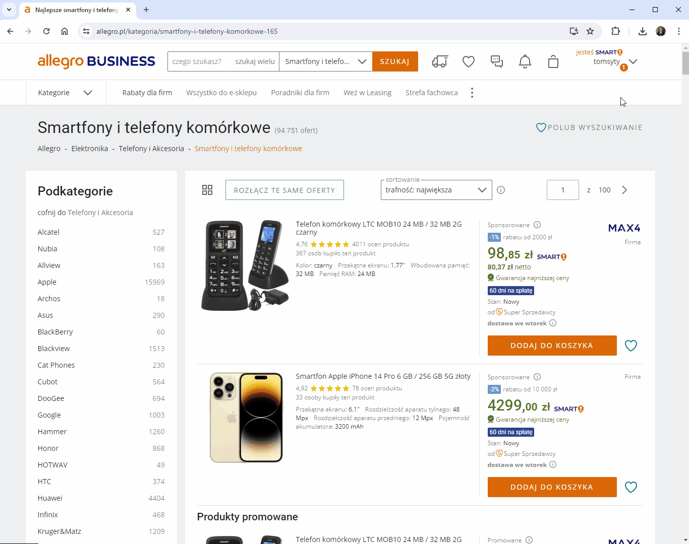

## Autofiltr dostawa z Polski
To rozszerzenie ma tylko jedną funkcję - zaznacza automatycznie filtr "Dostawa z Polski" przy przeglądaniu ofert na Allegro.

Jest to rozszerzenie do przeglądarki Chrome. Wszystkie rozszerzenia testuję tylko dla systemu Windows 10 i najnowszej wersji przeglądarki.

**Instrukcja instalacji:**
1. Pobierz rozszerzenie "autocheck_shipping_from_poland.zip" z listy plików widocznej powyżej i rozpakuj je tam gdzie zamierzasz je trzymać.
2. Kliknij ikonę menu rozszerzeń w prawym górnym rogu okna przeglądarki (ikona puzzla)  lub z menu przeglądarki wybierz "Rozszerzenia - Zarządzaj rozszerzeniami".
3. Włącz "Tryb dewelopera" w prawym górnym rogu okna przeglądarki 
4. Kliknij przycisk "Załaduj rozpakowane"  

5. Wybierz folder z uprzednio pobranym i rozpakowanym rozszerzeniem.

To wszystko. Po wejściu na stronę której adres zaczyna się od `https://allegro.pl/kategoria/` sprawdzane jest czy w adresie znajduje się parametr "miejsce-wysylki=polska". Jeśli nie, jest on dodawany do adresu i strona jest odświeżana celem zastosowania zmiany. Ze względów technicznych załadowanie rozszerzenia nie odbywa się od razu po wejściu na stronę tylko po kilku, kilkunastu sekundach - dopiero wtedy opcja "Dostawa z Polski" zostanie zaznaczona.

Rozszerzenie możesz sprawdzić w serwisie testowym [Allegro Sandbox](https://developer.allegro.pl/tutorials/informacje-podstawowe-b21569boAI1#srodowisko-testowe).  

***
Jeżeli napotkasz jakieś błędy w trakcie działania aplikacji, masz jakieś pytania, sugestie, problemy z obsługą, daj znać w sekcji "Discussions".
Jeżeli podoba Ci się moja praca i chcesz aby była dalej rozwijana, możesz wesprzeć mnie dotacją na dowolną kwotę przez PayPal (nie ma potrzeby posiadania konta PayPal): [przekaż donację](https://www.paypal.com/donate/?hosted_button_id=GVU3UC2ZY85SN&locale.x=pl_PL)
